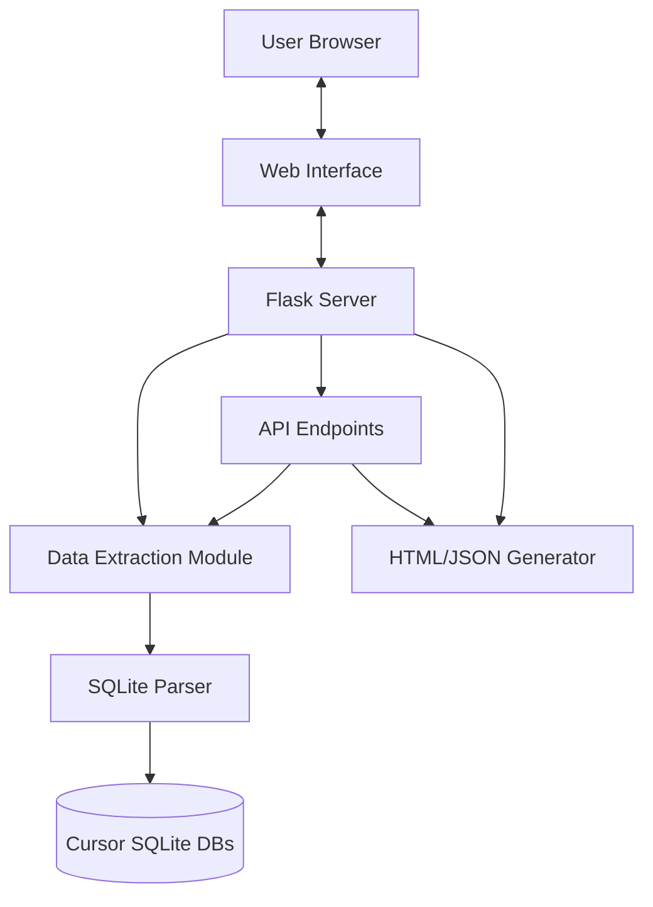

# Cursor View Server Documentation

## Overview

Cursor View is a local tool that allows users to view, search, and export all their Cursor AI chat histories in one place. The `server.py` file implements a Flask-based API server that scans local Cursor application data directories, extracts chat data from SQLite databases, and provides endpoints for viewing and exporting this data.

### Architecture Diagram



### Key Features

- Browse all Cursor chat sessions with full history
- Search through chat history
- Export chats as JSON or standalone HTML
- Organize chats by project
- View code blocks with syntax highlighting
- Access chat metadata including timestamps and project information

## Installation & Setup

### Prerequisites

- Python 3.6+
- Flask
- Cursor application installed (to access its SQLite databases)

### Setup Instructions

1. Install Python dependencies:
   ```
   pip install flask flask-cors markdown
   ```

2. Run the server:
   ```
   python server.py
   ```

3. Access the web interface at http://localhost:5000

### Command Line Arguments

The server accepts the following command line arguments:

- `--port`: Port to run the server on (default: 5000)
- `--debug`: Run in debug mode

## Core Components

### Data Extraction Module

The data extraction module is responsible for scanning Cursor's SQLite databases and extracting chat data. It includes functions for:

1. **Finding Database Locations**
   - `cursor_root()`: Determines the platform-specific Cursor data directory
   - `workspaces()`: Enumerates workspace databases
   - `global_storage_path()`: Locates the global storage database

2. **Extracting Chat Data**
   - `extract_chats()`: Main function that orchestrates the extraction process
   - `iter_bubbles_from_disk_kv()`: Extracts chat bubbles from the cursorDiskKV table
   - `iter_chat_from_item_table()`: Extracts chat data from the ItemTable
   - `iter_composer_data()`: Extracts metadata about chat sessions

3. **Project Information Extraction**
   - `workspace_info()`: Extracts project metadata from workspace databases
   - `extract_project_name_from_path()`: Attempts to infer project names from file paths
   - `extract_project_from_git_repos()`: Extracts project information from Git repositories

### API Endpoints

The server provides the following main API endpoints:

1. **Chat List**
   - `GET /api/chats`: Returns a list of all chat sessions

2. **Chat Details**
   - `GET /api/chat/<session_id>`: Returns details of a specific chat session
   - `GET /api/chat/<session_id>/raw`: Returns raw data of a specific chat session

3. **Export**
   - `GET /api/chat/<session_id>/export?format=html|json`: Exports a chat session as HTML or JSON

4. **Delete**
   - `DELETE /api/chat/<session_id>`: Deletes a specific chat session

### HTML/JSON Generation

The server can generate standalone HTML or JSON exports of chat sessions:

- `format_chat_for_frontend()`: Formats chat data for the frontend
- `generate_standalone_html()`: Generates a self-contained HTML file with styling for a chat session

## API Reference

### GET /api/chats

Returns a list of all chat sessions with their metadata.

**Response:**
```json
[
  {
    "session_id": "string",
    "title": "string",
    "project": {
      "name": "string",
      "rootPath": "string"
    },
    "date": 1622547123,
    "messages": [...]
  }
]
```

### GET /api/chat/{session_id}

Returns details of a specific chat session.

**Parameters:**
- `session_id`: The ID of the chat session to retrieve

**Response:**
```json
{
  "session_id": "string",
  "title": "string",
  "project": {
    "name": "string",
    "rootPath": "string"
  },
  "date": 1622547123,
  "messages": [
    {
      "role": "user|assistant",
      "content": "string",
      "codeBlocks": [
        {
          "content": "string",
          "language": "string"
        }
      ],
      "is_thought": false,
      "thinking": {},
      "tool_former_data": {}
    }
  ]
}
```

### GET /api/chat/{session_id}/export?format=html|json

Exports a chat session as HTML or JSON.

**Parameters:**
- `session_id`: The ID of the chat session to export
- `format`: The export format, either "html" or "json" (default: "html")

**Response:**
- For HTML: A standalone HTML file with the chat session content
- For JSON: A JSON file with the chat session data

### DELETE /api/chat/{session_id}

Deletes a specific chat session.

**Parameters:**
- `session_id`: The ID of the chat session to delete

**Response:**
```json
{
  "success": true,
  "message": "Chat deleted successfully"
}
```

### GET /api/chat/{session_id}/raw

Returns raw data of a specific chat session (for diagnostic purposes).

**Parameters:**
- `session_id`: The ID of the chat session to retrieve raw data for

**Response:**
```json
{
  "session_id": "string",
  "raw_bubbles": [...],
  "composer_data": {...},
  "item_table_data": {...},
  "formatted_messages": [...]
}
```

## Data Flow

The data flow in the application follows these steps:

1. **Database Discovery**
   - The application locates Cursor's SQLite databases based on the platform
   - It finds both workspace-specific and global storage databases

2. **Data Extraction**
   - Chat data is extracted from multiple sources (cursorDiskKV table and ItemTable)
   - Metadata is associated with each chat session

3. **Data Processing**
   - Chat messages are organized by session
   - Code blocks are extracted and associated with the proper language
   - Thinking and tool call data is processed

4. **API Serving**
   - API endpoints use the extracted data to serve requests
   - Data is formatted based on the request type (list, detail, export)

## Database Interaction

The server interacts with Cursor's SQLite databases in read-only mode. It primarily accesses:

1. **Global Storage Database**
   - Located at `<Cursor Data Directory>/User/globalStorage/state.vscdb`
   - Contains chat data from the cursorDiskKV table

2. **Workspace Databases**
   - Located at `<Cursor Data Directory>/User/workspaceStorage/<workspace_id>/state.vscdb`
   - Contains workspace-specific chat data and project information

The server uses several methods to extract data from different tables:

- `cursorDiskKV`: Contains chat bubbles (messages) and composer data (session metadata)
- `ItemTable`: Contains chat data and workspace information

## Utility Functions

The server includes several utility functions:

- `j()`: Helper function to extract JSON data from SQLite tables
- `delete_chat_from_db()`: Removes chat data from Cursor's databases
- `format_chat_for_frontend()`: Prepares chat data for frontend display

## Deployment Guidelines

### Production Considerations

1. **Security**
   - The server is designed for local use only
   - No authentication is implemented by default
   - Access should be restricted to localhost

2. **Performance**
   - Large chat histories may require significant memory
   - Consider increasing timeout values for large exports

3. **Logging**
   - Logs are written to `logs/cursor_view.log`
   - Debug level logging can be enabled with the `--debug` flag

### Best Practices

1. **Backup**
   - Always backup Cursor's SQLite databases before making any changes
   - The delete functionality modifies Cursor's databases directly

2. **Updates**
   - Cursor application updates may change database schema
   - Monitor for changes in Cursor's storage format

## Known Limitations

- The server currently only supports the formats used by recent versions of Cursor
- Some edge cases in chat formatting may not be handled perfectly
- The server does not provide editing functionality for chat history 